# 🚀 **Install AWS Discovery Agents on Web Server & Database Server**

## 📌 **Step 1: Download AWS Discovery Agent**
To collect **system performance data** and **network dependencies**, install the **AWS Discovery Agent** on your **on-premises servers**.

curl -o ./aws-discovery-agent.tar.gz https://s3-us-west-2.amazonaws.com/aws-discovery-agent.us-west-2/linux/latest/aws-discovery-agent.tar.gz

📌 Step 2: Extract and Install the Agent
Unpack the downloaded agent:

tar -xzf aws-discovery-agent.tar.gz

📌 Step 3: Verify Agent Installation
Check if the AWS Discovery Agent is running successfully:

sudo systemctl status aws-discovery-daemon.service

- View Servers

#### 1. Servers

## WebServer

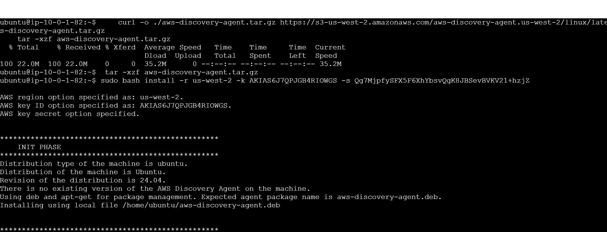

- Verify that ADS agent is running
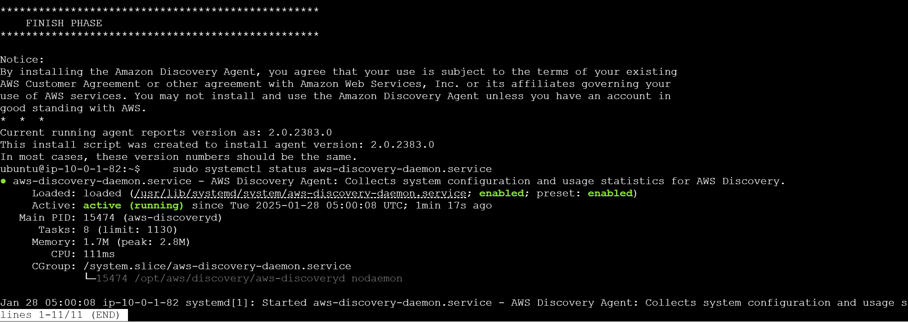

## DatabaseServer

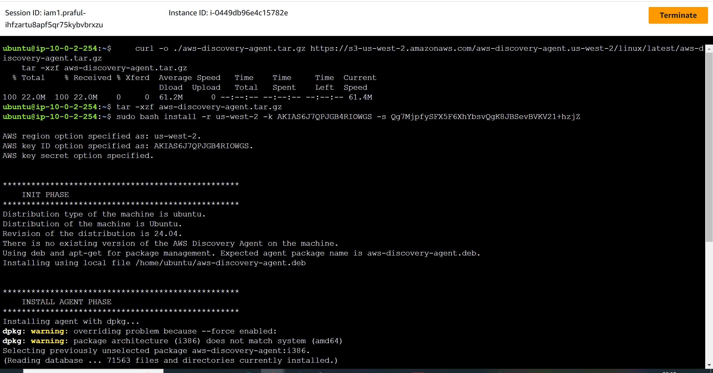

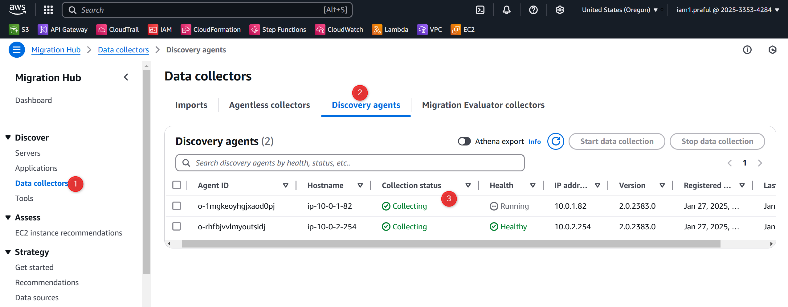

# ----------------------------------

### Review Collected Data
# Key Points on AWS Application Discovery Service Data Review 🚀

## **Performance Data** 📊
- **Agentless Collector**: 
  - Provides **average** and **peak utilization** for system performance.
- **Discovery Agent**: 
  - Collects **detailed time-series data**, including:
    - System performance 📈.
    - Inbound/outbound network connections 🌐.
    - Processes running on the server 🖥️.

## **TCO Analysis** 💰
- Use collected performance data for **high-level Total Cost of Ownership (TCO)** calculations.

## **Network Dependency Mapping** 🔗
- Discovery Agent identifies **network dependencies** between servers.
- Group related servers into **applications** for migration planning.

## **Data Review in Console** 🛠️
- Access **general views** and **detailed views** of discovered servers.
- Use insights for **migration planning** and application grouping.

# Review Collected data for WebServer

- Go to 'Migration Hub' 
- Data collector collecting data

- View discovered serverers
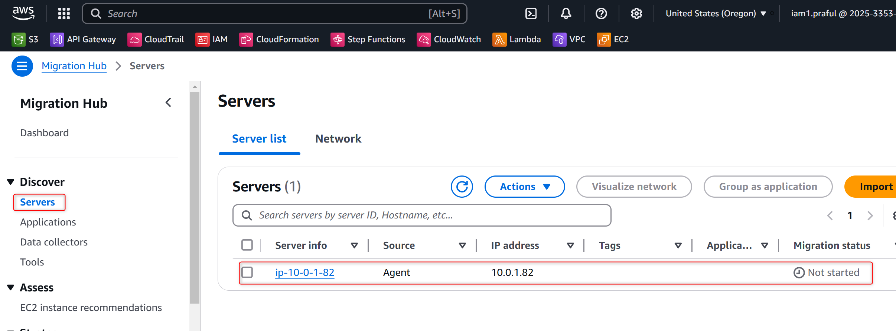

- Technical information  
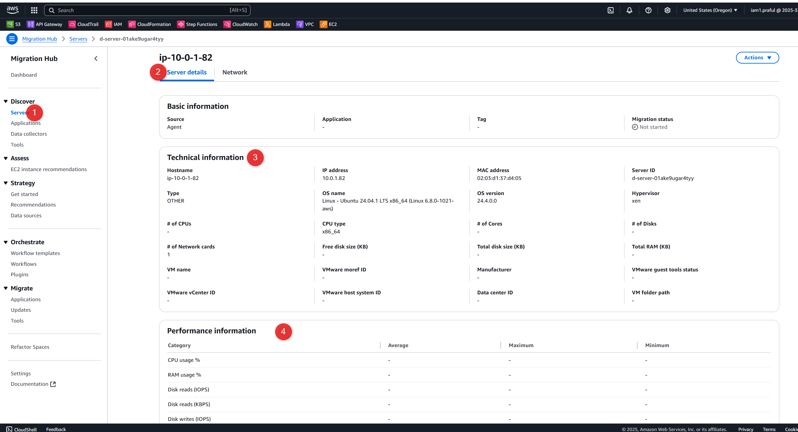

- Collected more information
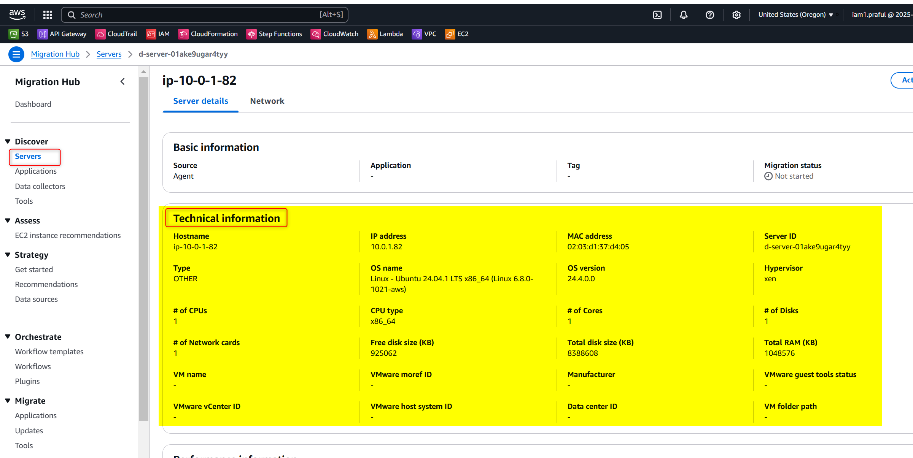

- Performance information

- Collected more information
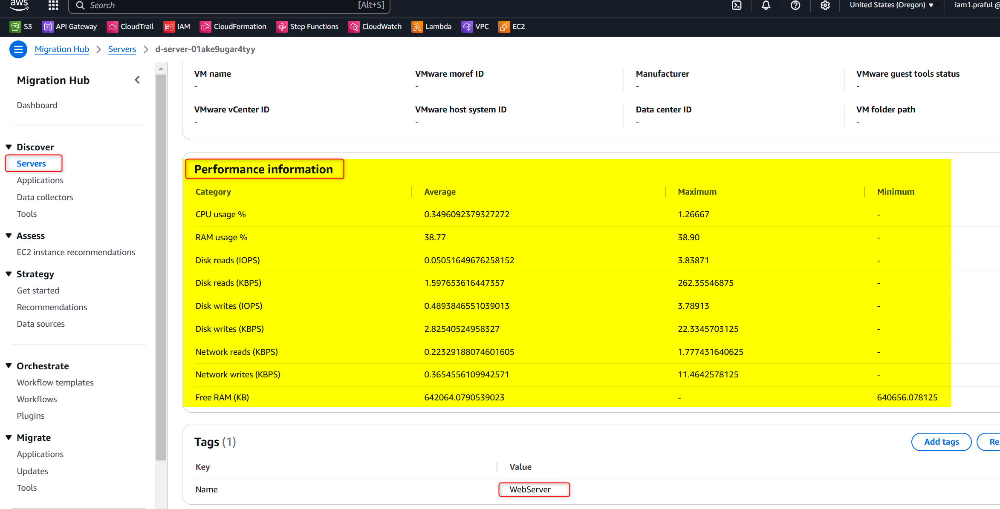

- View Netowrk Connections

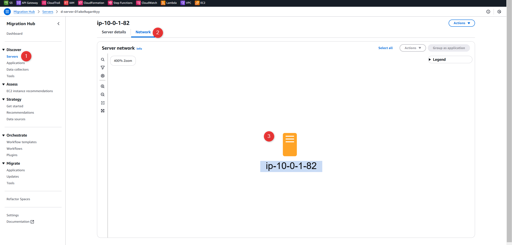

# Review Collected data for DatabaseServer

- Go to 'Migration Hub' 
- Data collector collecting data

- View discovered serverers
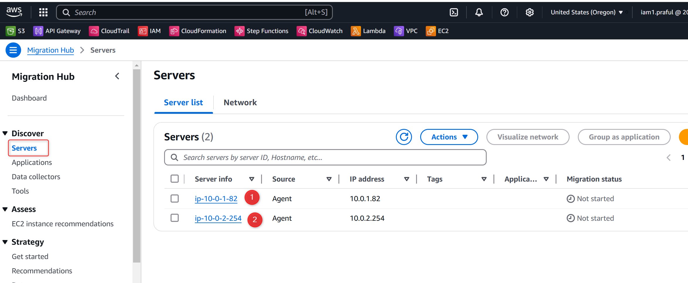

- Technical information  
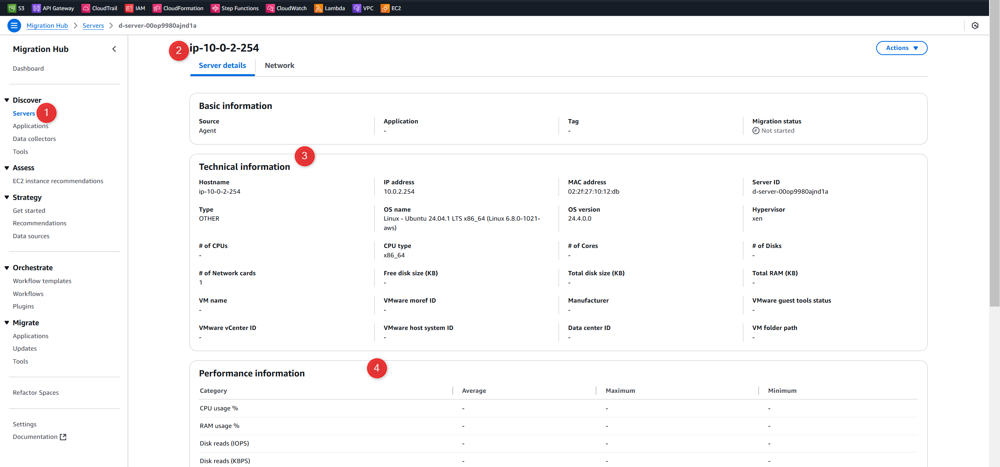
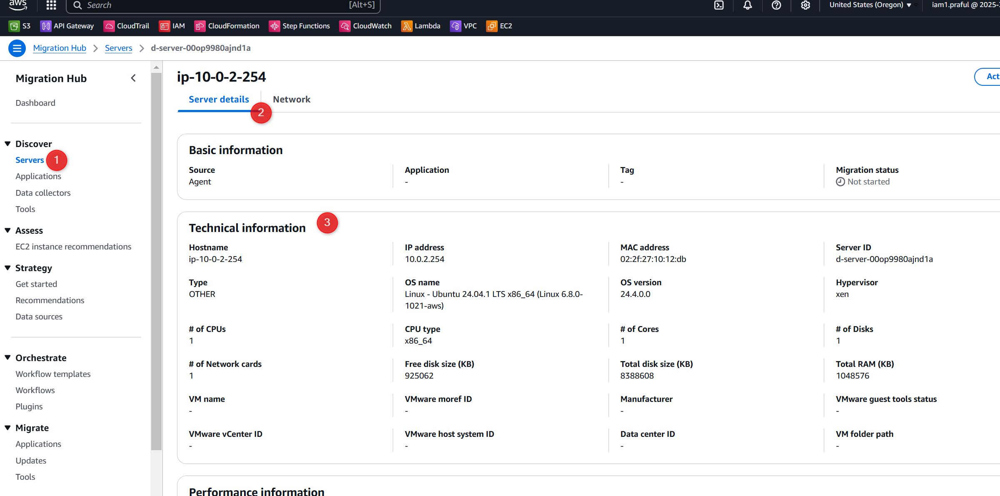

- Collected more information
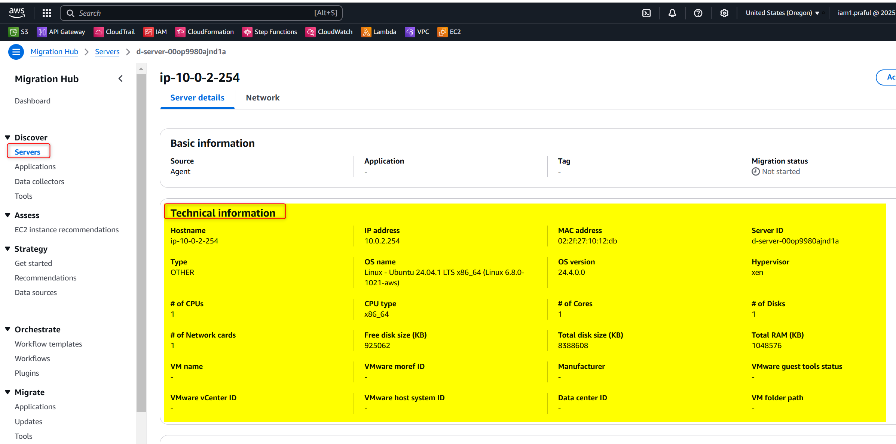

- Performance information

- Collected more information
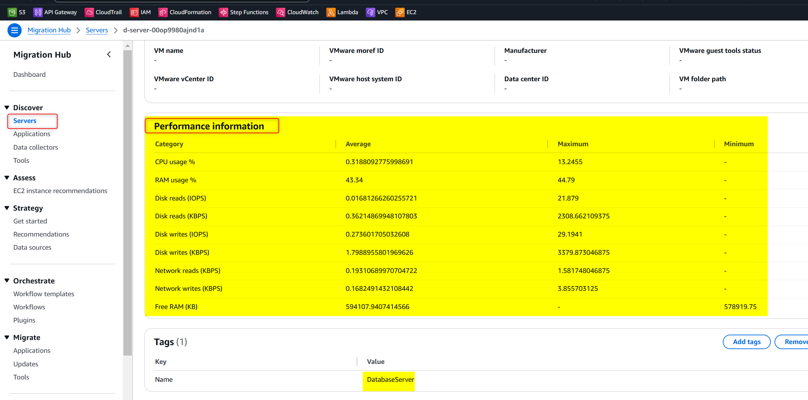

- View Netowrk Connections
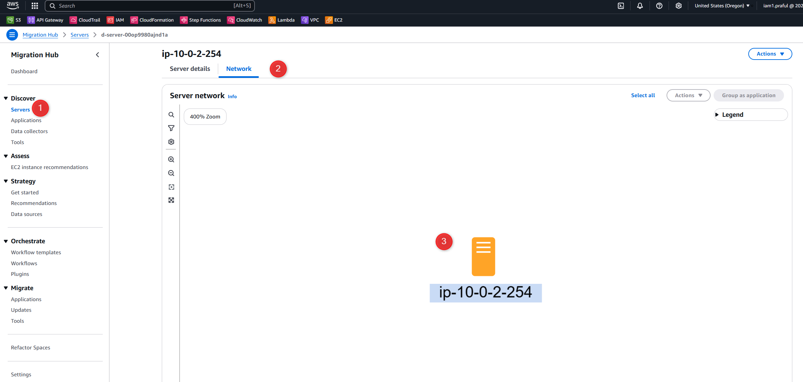
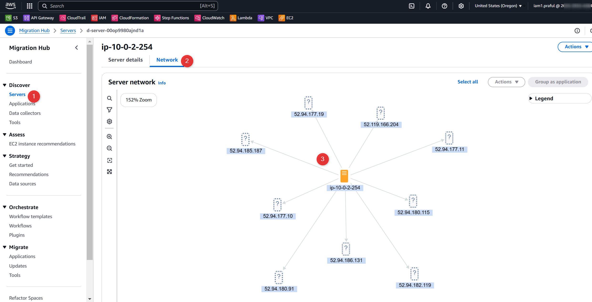
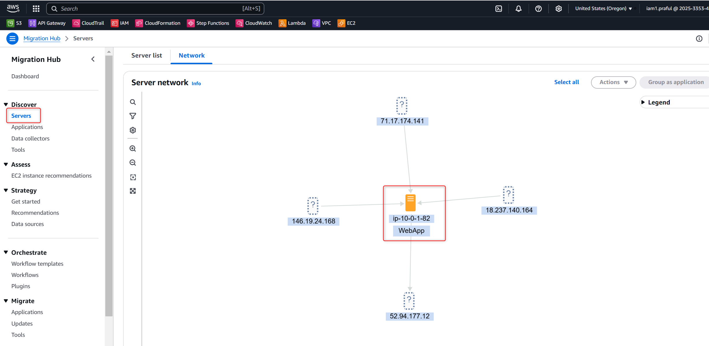
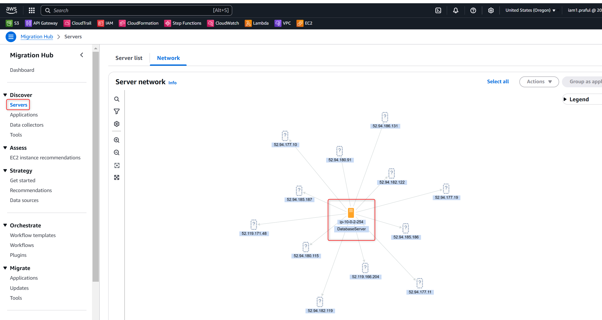

## Group as Application

- Select a WebServer and Group as WebApplication 

- Name Group
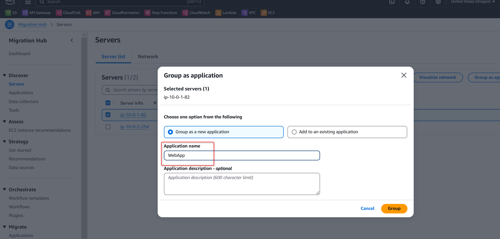

- Groupped the relevant severs on the application basis
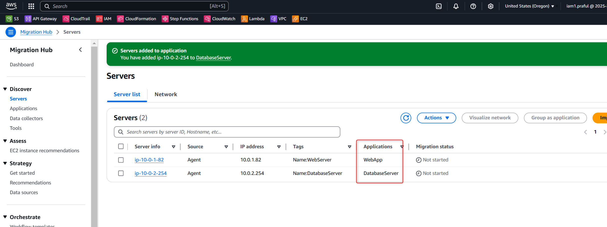

#### 2. Applications

- Applications displayed under application section after grouping
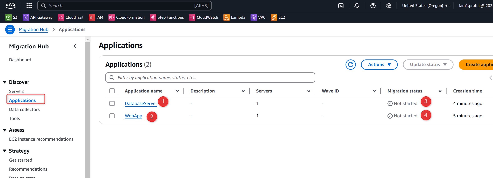

# Tools Used for Migration in This Phase 🛠️

## **1. AWS Application Discovery Service (ADS)** ⚙️
- Deployed **ADS Agent** to collect system performance data, network dependencies, and server details 🖥️.

## **2. AWS Migration Hub** 🌍
- Centralized dashboard for:
  - Reviewing server inventory 🗂️.
  - Visualizing network dependencies 🌐.
  - Grouping servers into applications 🗃️.
  - Managing tags for better organization 🏷️.

## **3. IAM (Identity and Access Management)** 🔐
- Created an **IAM user** and credentials for secure access to AWS services.

## **4. AWS CloudTrail** 🔍
- Optional tool for monitoring activity logs to track migration-related actions 📋.

## **5. Application Groups** 🗂️
- Utilized within Migration Hub to organize and manage servers efficiently.

### **Outcome** 🚀
These tools provided the foundation to collect, review, and organize critical data for a seamless migration process.

# AWS Application Discovery Service (ADS) Setup and Achievements 🚀

## **What We Achieved** ✅

### **1. Initialized and Configured ADS** ⚙️
- Set **Migration Hub Home Region** 🌍.
- Created an **IAM user and credentials** 🔐.
- Deployed the **ADS Agent** to:
  - **Source Web Server** 🖥️.
  - **Database Server** 🗄️.

### **2. Verified Data Collection** 🔍
- Ensured **data collection started** and is in a **healthy condition** 🩺.

### **3. Reviewed Migration Hub Data and Options** 📊
- **Server List**: Detailed inventory of discovered servers 🗂️.
- **Network Visualization**: Insights into network dependencies 🌐.
- **Application Grouping**: Organized servers into application groups 🗃️.
- **Tags**:
  - Optionally created tags and assigned them to servers 🏷️.

### **4. Managed Application Groups and Tags** 🛠️
- Created **Application Groups** 🗂️.
- Added or removed servers from application groups ➕➖.
- Optionally updated the **status of applications** 📋.

### **Next Step: Database Server Migration** 🚀
With ADS configured and data reviewed, it's now time to **migrate and configure the database server**! 🗄️➡️☁️
