## 🚀 Configure On-Prem Source Database for AWS DMS Migration
 
# Enable CDC on source database

- In the terminal, we need connect to MySQL server and grant privileges for to the wordpress-user database user (the user we will use with the CDC feature):

sudo mysql -u root -pAWSRocksSince2006

GRANT REPLICATION CLIENT ON *.* to 'obbsadmin';
GRANT REPLICATION SLAVE ON *.* to 'obbsadmin';
GRANT SUPER ON *.* to 'obbsadmin';

exit

 

- In MySQL, the binary log  contains “events” that describe database changes such as table creation operations or changes to table data. This is crucial for the continuous replication task with DMS. In the same terminal, let's create the directory structure for MySQL binary logs: 

sudo su - 
mkdir /var/lib/mysql/binlogs
chown -R mysql\:mysql /var/lib/mysql/binlogs
exit

- Then, let's modify the MySQL configuration to enable the Binary Log. In the terminal, execute:

sudo su -
cp /etc/mysql/mysql.conf.d/mysqld.cnf /etc/mysql/my.cnf
chown -R mysql\:mysql /etc/mysql/my.cnf
cat <<EOF >> /etc/mysql/my.cnf
server_id=1
log-bin=/var/lib/mysql/binlogs/log
binlog_format=ROW
expire_logs_days=1
binlog_checksum=NONE
binlog_row_image=FULL
log_slave_updates=TRUE
performance_schema=ON
EOF

- To have the changes implemented, we need to restart MySQL service. For that, execute in the terminal:

sudo systemctl restart mysql

In the terminal, let's verify if the changes took effect running the commands and comparing with the screenshot:

sudo mysql -u root -pAWSRocksSince2006

select variable_value as "BINARY LOGGING STATUS (log-bin) :: "
from performance_schema.global_variables where variable_name='log_bin';
select variable_value as "BINARY LOG FORMAT (binlog_format) :: "
from performance_schema.global_variables where variable_name='binlog_format';

exit

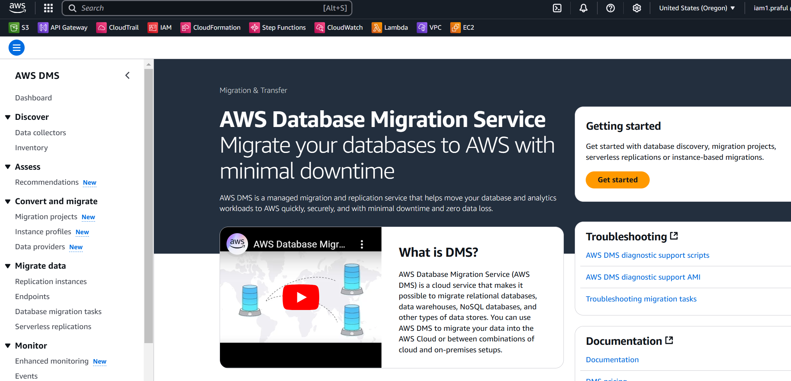

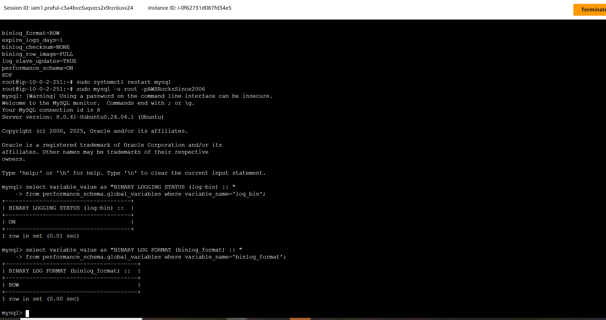

## Create Source and Target Endpoint

- Create Source Endpoint

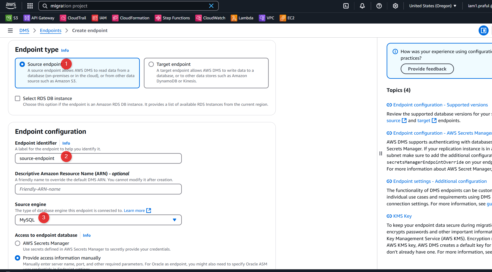

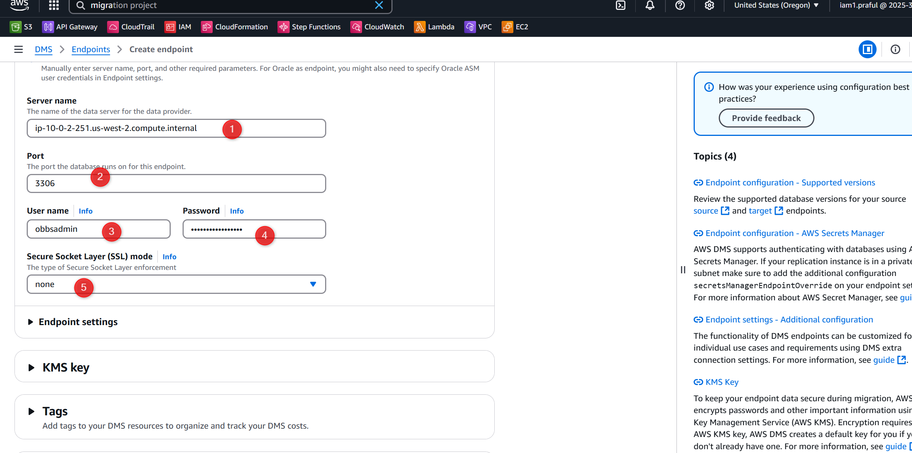

- Create Database Endpoint

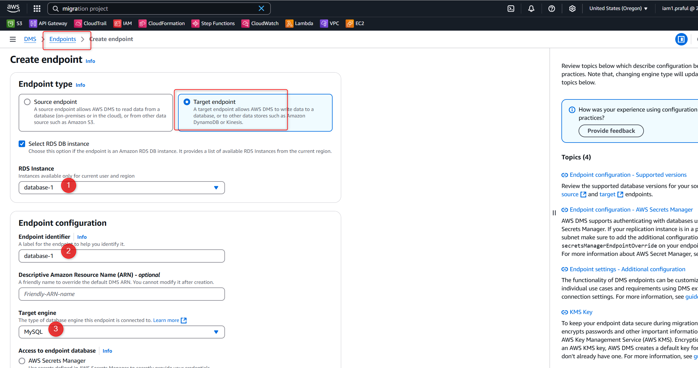

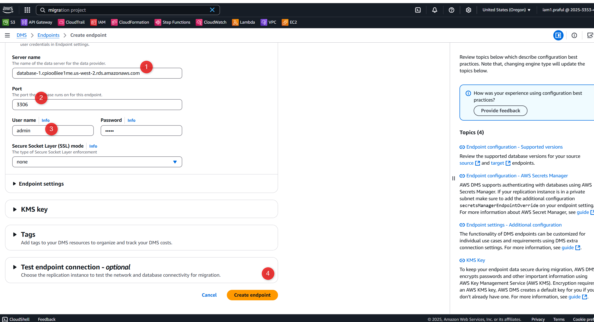

- Both endpoint created
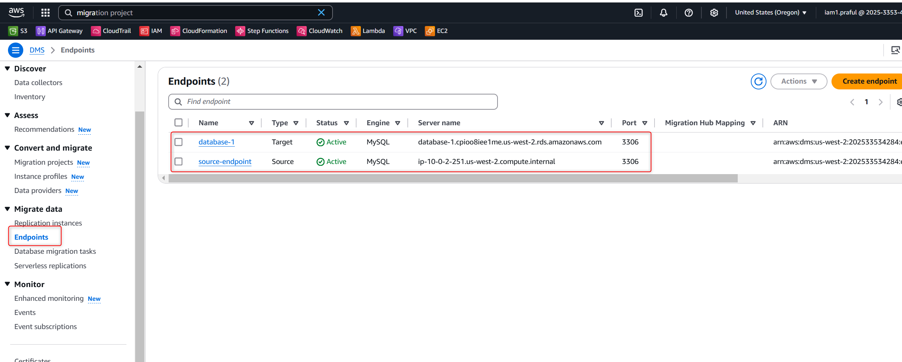

- Target Database Endpoint successful
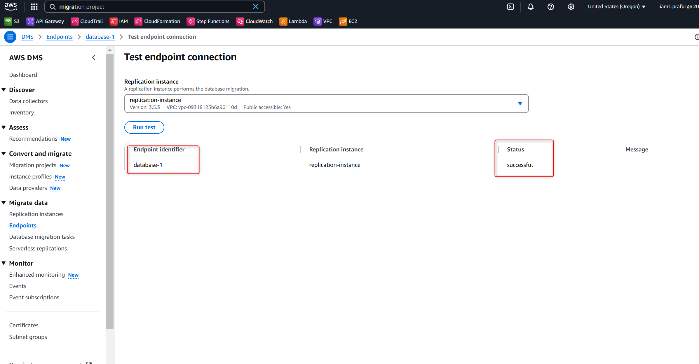

## Create database migration Task:

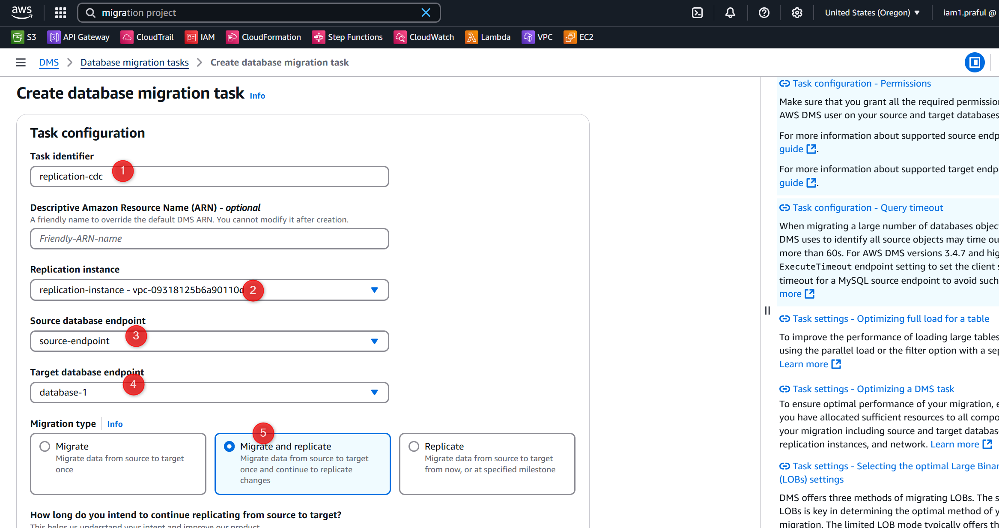
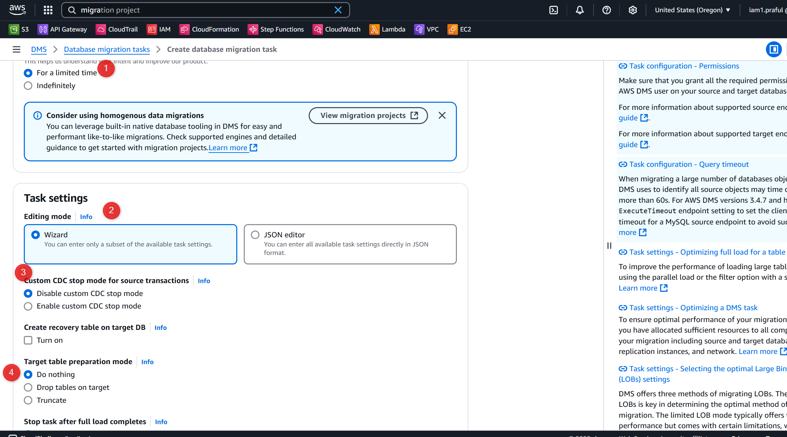 

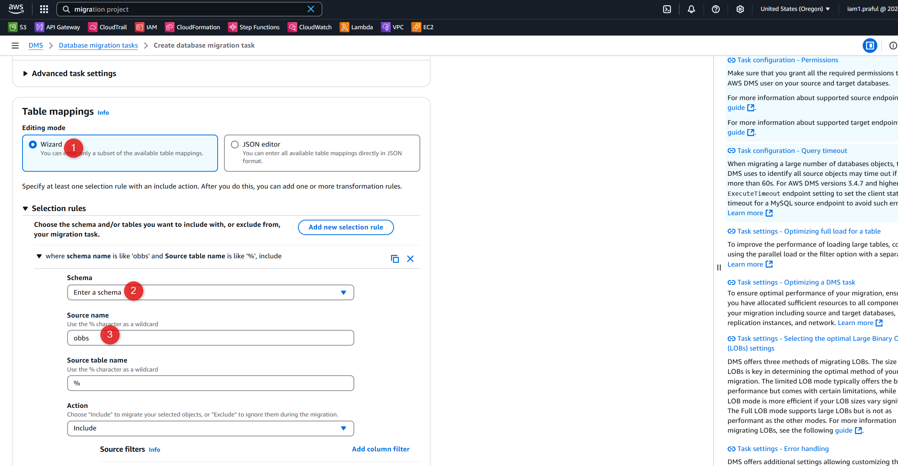 
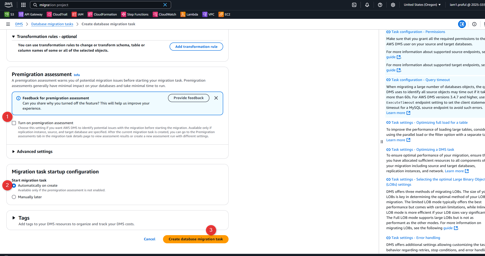  
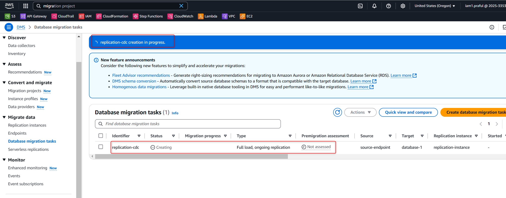

- DMS Task Created

- Created
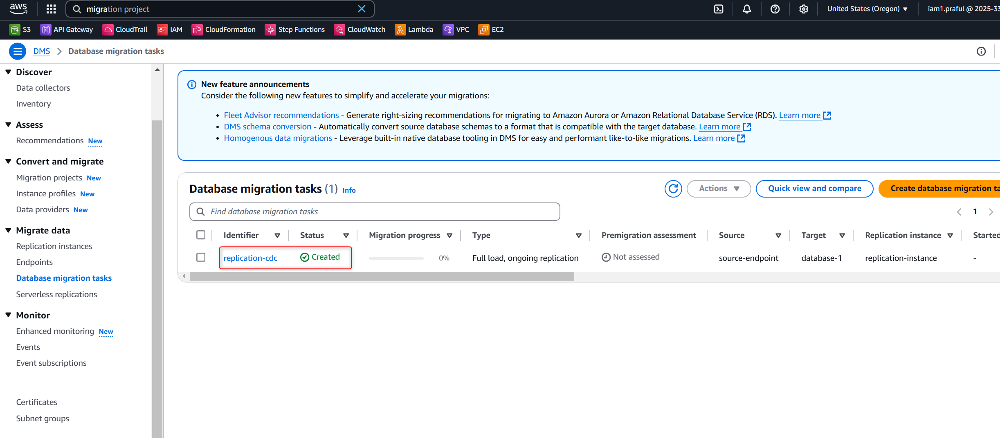
- STarting

- DMS Load Complete Successful
-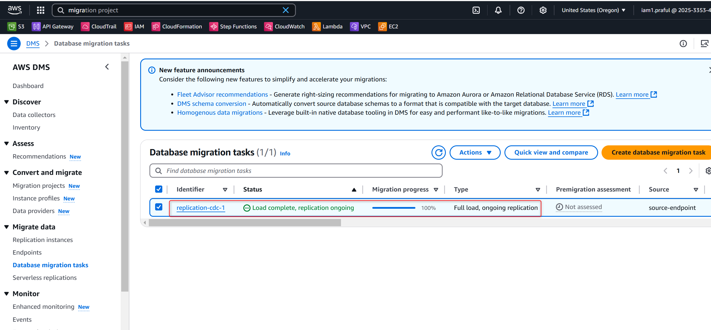

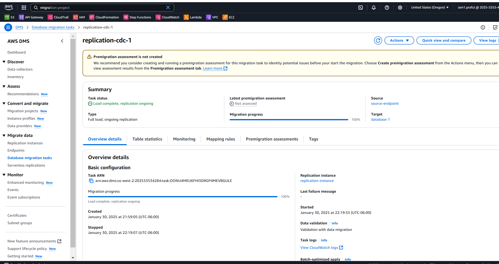
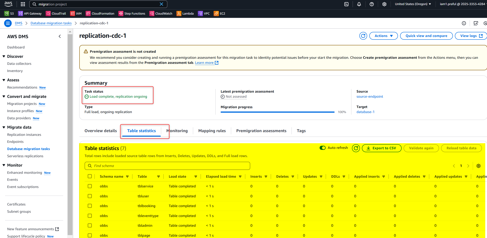

## Let's Test & verify that the Database 'Obbs" successfuly migrated with all the tables and data into AWS RDS MySQL
- ** Note: You need to createa Jumphost in order login into RDS MysQL

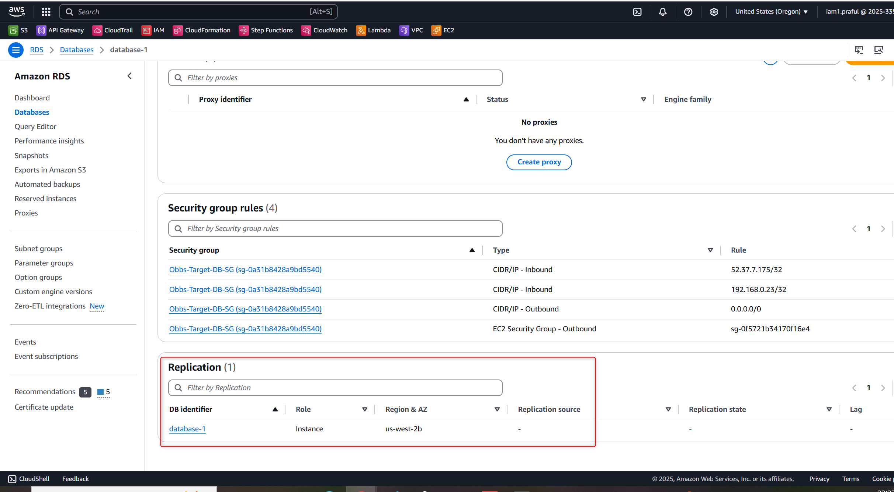

- Login tin RDS My SQL 
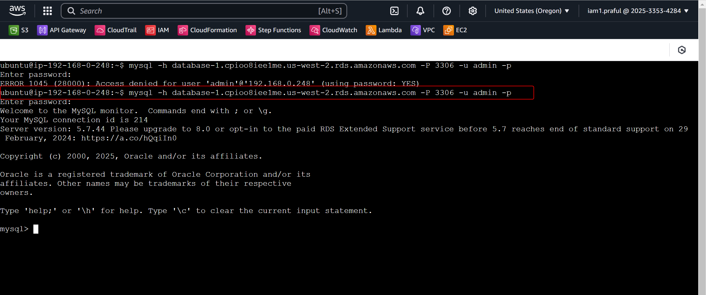

- Select the database 'Obbs' and show all the tables
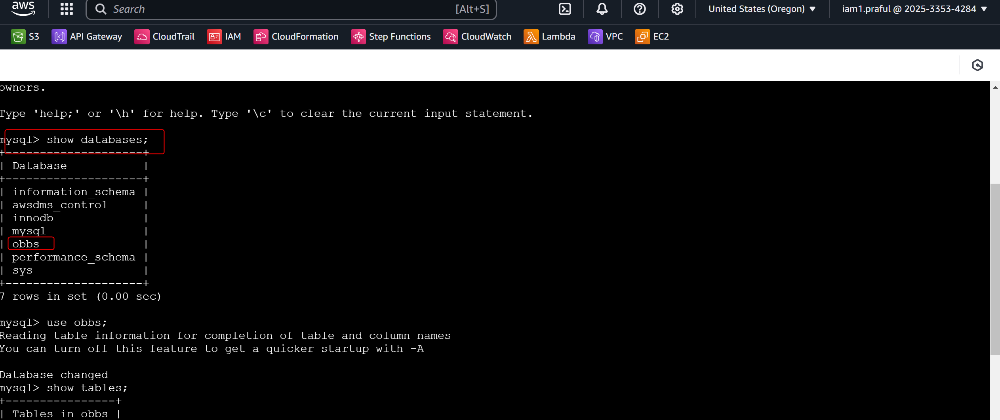

- Select the tabluser and Test that the data from On-Prem successfuly migrated and visible into table

## Database migration successfully

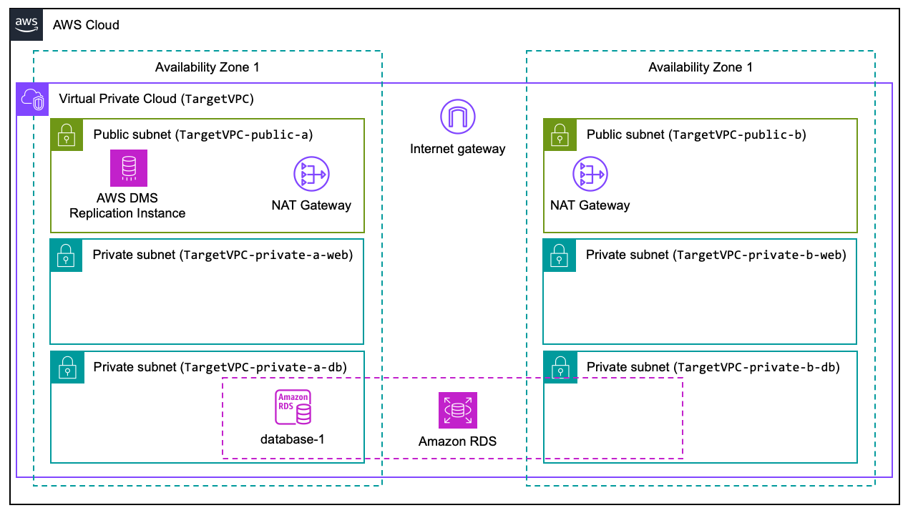

## What we achieved
- Created a new managed database, using Amazon Relational Database Service (RDS)
- Created an AWS Database Migration Service (DMS) Replication = Instance - that allows you to replicate data between databases
- Created the source and target DMS Endpoints
- Modified the configuration of the source database to allow for continuous replication of data (binary log)
- Started the replication of data through a DMS replication task