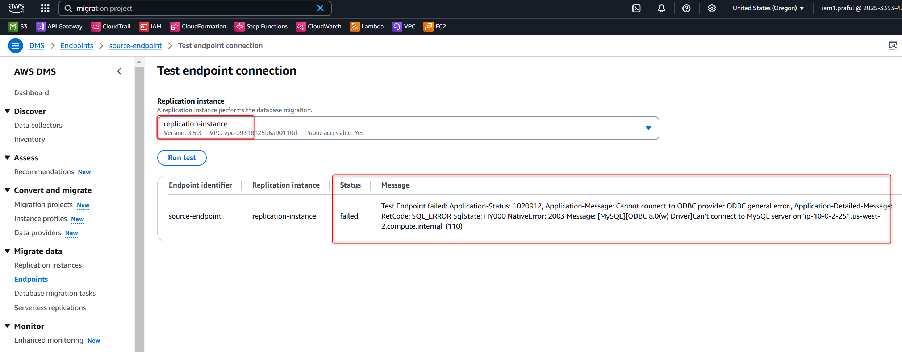
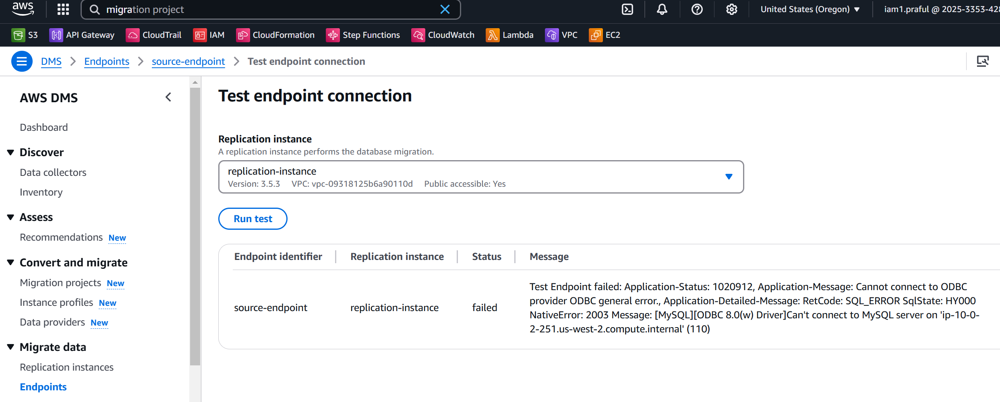
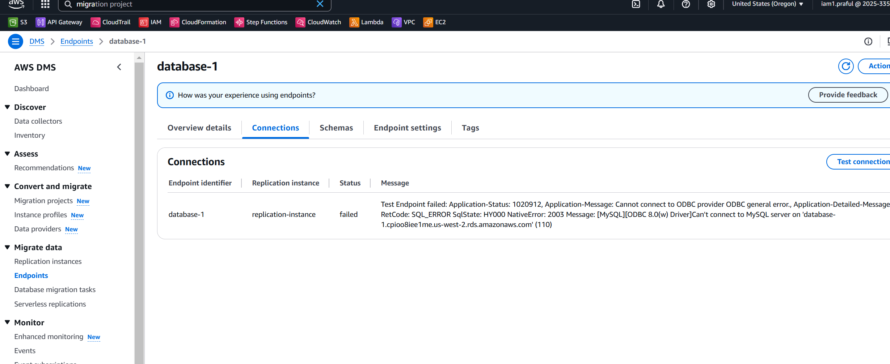
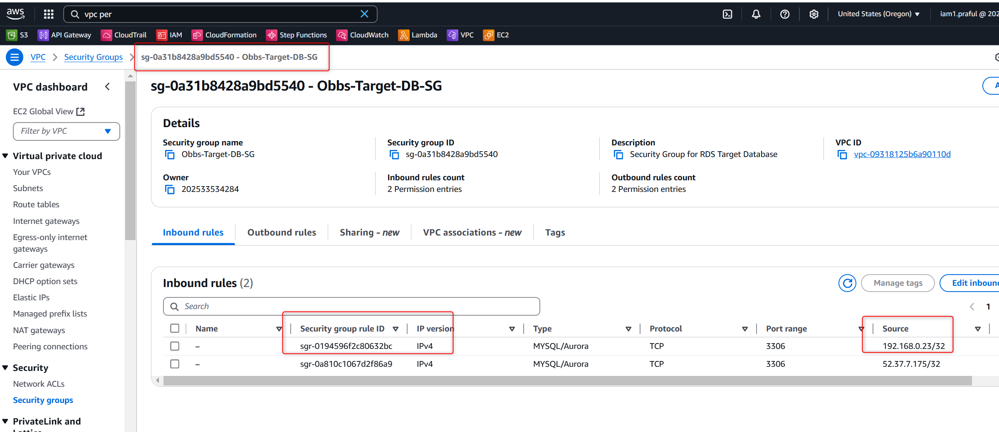

## Troubleshooting

- Peering connection 

- Database Target endpoint conection test failed - Error

- Add DMS replication instances private ip into Target-RDS-SG security group inbound rules

*** Database replication migration issue 

✅ Fixing AWS DMS Migration Error: Unknown Collation 'utf8mb4_0900_ai_ci'
Your AWS DMS migration failed due to an unsupported collation (utf8mb4_0900_ai_ci) in MySQL. This collation is specific to MySQL 8.0, but older MySQL versions (5.7, RDS Aurora, MariaDB) do not support it. AWS DMS does not convert collation types automatically, leading to migration failures.

🔥 Solution: Convert Collation Before Migration
To resolve this issue, convert the collation of all affected tables and columns in your source database before running the migration.

🔍 Step 1: Identify Affected Tables
Run the following SQL command on your source MySQL database to find tables using the utf8mb4_0900_ai_ci collation:

sql
Copy
Edit
SELECT table_name, column_name, character_set_name, collation_name 
FROM information_schema.columns 
WHERE table_schema = 'obbs'
AND collation_name = 'utf8mb4_0900_ai_ci';
✅ If this query returns results, those columns must be modified before migration.

🔹 Step 2: Convert Table-Level Collation
Since AWS DMS does not support utf8mb4_0900_ai_ci, we will convert it to a supported collation (utf8mb4_general_ci or utf8mb4_unicode_ci).

Convert entire tables
For each table listed in the error log, run:

sql
Copy
Edit
ALTER TABLE obbs.tbladmin CONVERT TO CHARACTER SET utf8mb4 COLLATE utf8mb4_general_ci;
ALTER TABLE obbs.tblbooking CONVERT TO CHARACTER SET utf8mb4 COLLATE utf8mb4_general_ci;
ALTER TABLE obbs.tblcontact CONVERT TO CHARACTER SET utf8mb4 COLLATE utf8mb4_general_ci;
ALTER TABLE obbs.tbleventtype CONVERT TO CHARACTER SET utf8mb4 COLLATE utf8mb4_general_ci;
ALTER TABLE obbs.tblpage CONVERT TO CHARACTER SET utf8mb4 COLLATE utf8mb4_general_ci;
ALTER TABLE obbs.tblservice CONVERT TO CHARACTER SET utf8mb4 COLLATE utf8mb4_general_ci;
ALTER TABLE obbs.tbluser CONVERT TO CHARACTER SET utf8mb4 COLLATE utf8mb4_general_ci;
✅ This converts the table’s default collation and fixes migration failures.

🔹 Step 3: Convert Column-Level Collation (If Needed)
If you cannot convert the entire table, update only the affected columns:

sql
Copy
Edit
ALTER TABLE obbs.tbladmin MODIFY AdminName VARCHAR(120) CHARACTER SET utf8mb4 COLLATE utf8mb4_general_ci;
ALTER TABLE obbs.tbladmin MODIFY UserName VARCHAR(120) CHARACTER SET utf8mb4 COLLATE utf8mb4_general_ci;
ALTER TABLE obbs.tbladmin MODIFY Email VARCHAR(200) CHARACTER SET utf8mb4 COLLATE utf8mb4_general_ci;

ALTER TABLE obbs.tblbooking MODIFY EventType VARCHAR(200) CHARACTER SET utf8mb4 COLLATE utf8mb4_general_ci;
ALTER TABLE obbs.tblbooking MODIFY Message MEDIUMTEXT CHARACTER SET utf8mb4 COLLATE utf8mb4_general_ci;
ALTER TABLE obbs.tblbooking MODIFY Remark VARCHAR(200) CHARACTER SET utf8mb4 COLLATE utf8mb4_general_ci;
ALTER TABLE obbs.tblbooking MODIFY Status VARCHAR(200) CHARACTER SET utf8mb4 COLLATE utf8mb4_general_ci;

ALTER TABLE obbs.tblcontact MODIFY Name VARCHAR(200) CHARACTER SET utf8mb4 COLLATE utf8mb4_general_ci;
ALTER TABLE obbs.tblcontact MODIFY Email VARCHAR(200) CHARACTER SET utf8mb4 COLLATE utf8mb4_general_ci;
ALTER TABLE obbs.tblcontact MODIFY Message MEDIUMTEXT CHARACTER SET utf8mb4 COLLATE utf8mb4_general_ci;

ALTER TABLE obbs.tbleventtype MODIFY EventType VARCHAR(200) CHARACTER SET utf8mb4 COLLATE utf8mb4_general_ci;

ALTER TABLE obbs.tblpage MODIFY PageType VARCHAR(100) CHARACTER SET utf8mb4 COLLATE utf8mb4_general_ci;
ALTER TABLE obbs.tblpage MODIFY PageTitle MEDIUMTEXT CHARACTER SET utf8mb4 COLLATE utf8mb4_general_ci;
ALTER TABLE obbs.tblpage MODIFY PageDescription MEDIUMTEXT CHARACTER SET utf8mb4 COLLATE utf8mb4_general_ci;
ALTER TABLE obbs.tblpage MODIFY Email VARCHAR(200) CHARACTER SET utf8mb4 COLLATE utf8mb4_general_ci;

ALTER TABLE obbs.tblservice MODIFY ServiceName VARCHAR(200) CHARACTER SET utf8mb4 COLLATE utf8mb4_general_ci;
ALTER TABLE obbs.tblservice MODIFY SerDes VARCHAR(250) CHARACTER SET utf8mb4 COLLATE utf8mb4_general_ci;
ALTER TABLE obbs.tblservice MODIFY ServicePrice VARCHAR(200) CHARACTER SET utf8mb4 COLLATE utf8mb4_general_ci;

ALTER TABLE obbs.tbluser MODIFY UserName VARCHAR(200) CHARACTER SET utf8mb4 COLLATE utf8mb4_general_ci;
ALTER TABLE obbs.tbluser MODIFY Email VARCHAR(200) CHARACTER SET utf8mb4 COLLATE utf8mb4_general_ci;
✅ This ensures each column uses a compatible collation.

🔹 Step 4: Restart AWS DMS Migration Task
1️⃣ Stop AWS DMS Task

Go to AWS DMS Console
Select the task
Click Stop Task
2️⃣ Restart AWS DMS Task

Click Start Task
Choose Resume Processing
3️⃣ Monitor Logs

Check CloudWatch logs for any new errors.
🎯 Summary
✅ Action	🔍 Command / Fix
Check affected tables	SELECT table_name, column_name, character_set_name, collation_name FROM information_schema.columns WHERE collation_name = 'utf8mb4_0900_ai_ci';
Convert Table-Level Collation	ALTER TABLE obbs.tbladmin CONVERT TO CHARACTER SET utf8mb4 COLLATE utf8mb4_general_ci;
Convert Column-Level Collation	ALTER TABLE obbs.tbladmin MODIFY AdminName VARCHAR(120) CHARACTER SET utf8mb4 COLLATE utf8mb4_general_ci;
Restart AWS DMS Task	Stop & Start Migration from AWS DMS Console
Monitor Logs	Check CloudWatch logs for errors
